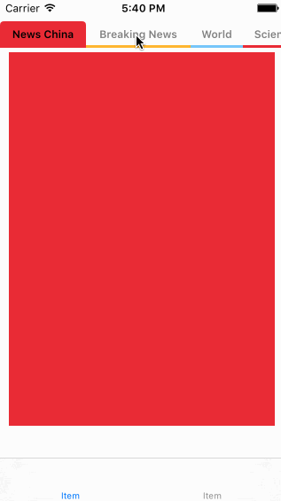

# WBSegmentControl

[](https://travis-ci.org/xiongxiong/WBSegmentControl)
[](http://cocoapods.org/pods/WBSegmentControl)
[](http://cocoapods.org/pods/WBSegmentControl)
[](http://cocoapods.org/pods/WBSegmentControl)

## Example

To run the example project, clone the repo, and run `pod install` from the Example directory first.

## ScreenShot


## Installation

WBSegmentControl is available through [CocoaPods](http://cocoapods.org). To install
it, simply add the following line to your Podfile:

```ruby
pod "WBSegmentControl"
```

## Usage
### Settings - Common
    public var indicatorStyle: IndicatorStyle = .Rainbow
    public var nonScrollDistributionStyle: NonScrollDistributionStyle = .Average
    public var enableSeparator: Bool = false
    public var separatorColor: UIColor = UIColor.blackColor()
    public var separatorWidth: CGFloat = 9
    public var separatorEdgeInsets: UIEdgeInsets = UIEdgeInsets(top: 8, left: 4, bottom: 8, right: 4)
    public var enableSlideway: Bool = false
    public var slidewayHeight: CGFloat = 1
    public var slidewayColor: UIColor = UIColor.lightGrayColor()
    public var enableAnimation: Bool = true
    public var animationDuration: NSTimeInterval = 0.15
    public var contentBackgroundColor: UIColor = UIColor.whiteColor()
    public var contentEdgeInsets: UIEdgeInsets = UIEdgeInsets(top: 5, left: 0, bottom: 5, right: 0)
    public var segmentMinWidth: CGFloat = 50
    public var segmentEdgeInsets: UIEdgeInsets = UIEdgeInsets(top: 0, left: 10, bottom: 0, right: 10)
    public var segmentTextFontSize: CGFloat = 12
    public var segmentTextForegroundColor: UIColor = UIColor.grayColor()
    public var segmentTextForegroundColorSelected: UIColor = UIColor.blackColor()
    
### Settings - indicatorStyle == .Cover
    public var cover_range: CoverRange = .Segment
    public var cover_opacity: Float = 0.2
    public var cover_color: UIColor = UIColor.blackColor()
    
### Settings - indicatorStyle == .Strip
    public var strip_range: StripRange = .Content
    public var strip_location: StripLocation = .Down
    public var strip_color: UIColor = UIColor.orangeColor()
    public var strip_height: CGFloat = 3
    
### Settings - indicatorStyle == .Rainbow
    public var rainbow_colors: [UIColor] = []
    public var rainbow_height: CGFloat = 3
    public var rainbow_roundCornerRadius: CGFloat = 4
    public var rainbow_location: RainbowLocation = .Down
    public var rainbow_outsideColor: UIColor = UIColor.grayColor()
    
### Settings - indicatorStyle == .Arrow
    public var arrow_size: CGSize = CGSizeMake(6, 6)
    public var arrow_location: ArrowLocation = .Down
    public var arrow_color: UIColor = UIColor.orangeColor()
    
### Settings - indicatorStyle == .ArrowStrip
    public var arrowStrip_location: ArrowStripLocation = .Up
    public var arrowStrip_color: UIColor = UIColor.orangeColor()
    public var arrowStrip_arrowSize: CGSize = CGSizeMake(6, 6)
    public var arrowStrip_stripHeight: CGFloat = 2
    public var arrowStrip_stripRange: ArrowStripRange = .Content

## Author

xiongxiong, ximengwuheng@163.com

## License

WBSegmentControl is available under the MIT license. See the LICENSE file for more info.
